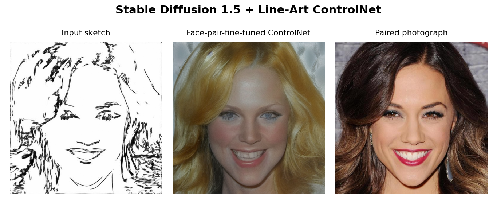
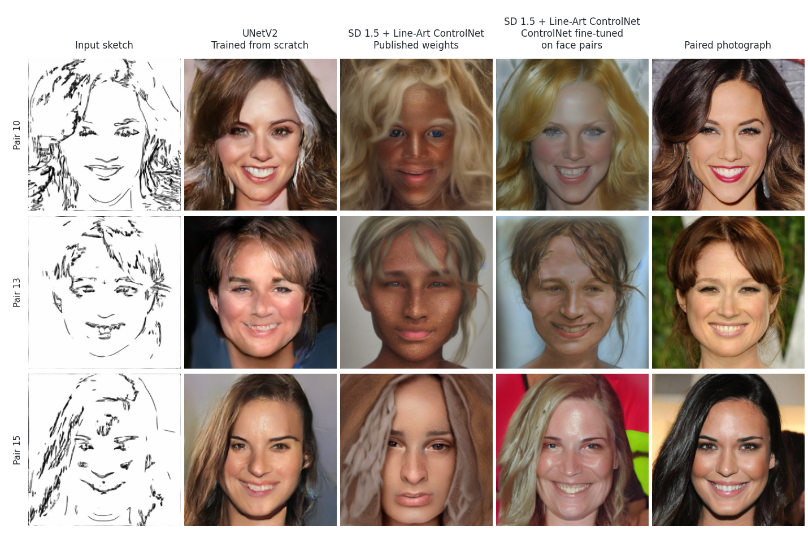
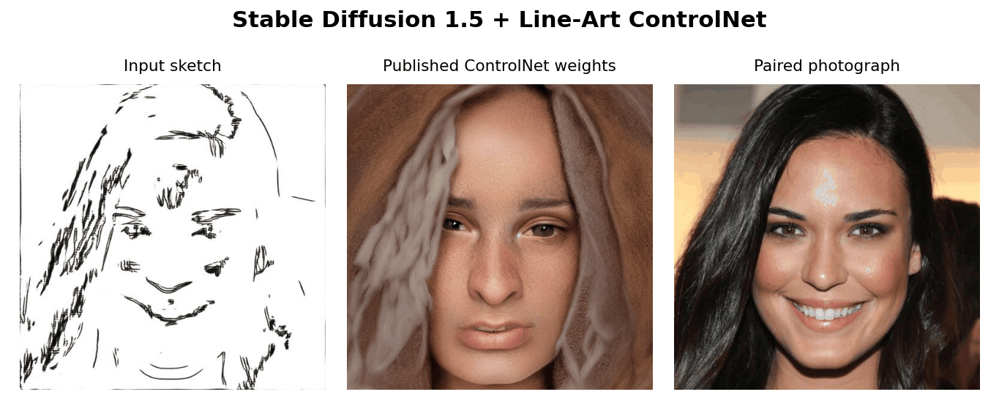
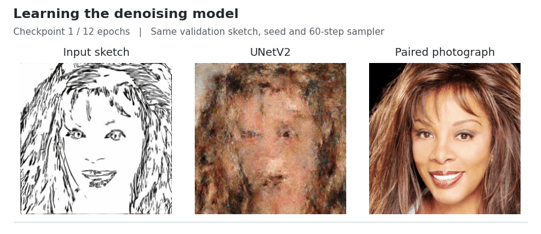
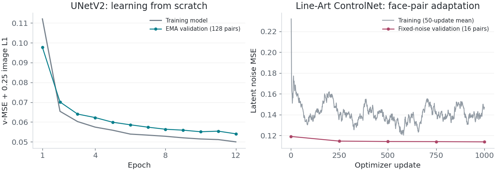

# Face Sketch Diffusion

Sketch-to-photo face generation with **SD 1.5 + Line-Art ControlNet fine-tuned on face pairs**, compared with **UNetV2 trained from scratch**.



*SD 1.5 + Line-Art ControlNet fine-tuned on face pairs. Validation pair 10; the photograph is a reference, not a generation input.*

[Generations](#generations) | [Methods](#methods) | [Training](#training) | [Evaluation](#evaluation) | [Data](#data) | [Notebooks](#notebooks) | [Running the experiments](#running-the-experiments)

## Generations

The same sketches are passed to three models: UNetV2, SD 1.5 with the published Line-Art ControlNet, and SD 1.5 with that ControlNet fine-tuned on face pairs.



*Validation pairs 10, 13 and 15. Both ControlNet columns use SD 1.5; only the ControlNet weights change. [All 16 validation pairs](notebooks/05_compare_approaches.ipynb).*

In these examples, the fine-tuned ControlNet produces detailed portraits with expressions closer to the sketches, particularly the smiles. UNetV2 preserves much of the paired photograph's color and layout, with softer texture and less precise facial geometry. Hair color, background and identity are not uniquely determined by the sketch.

## Methods

### Pixel-space diffusion: UNet and UNetV2

Given a sketch $s$, the model represents a conditional distribution $p_\theta(x_0\mid s)$ over photographs. The forward process corrupts the photograph at a randomly sampled noise level:

```math
x_t=a_t x_0+b_t\epsilon,\qquad
a_t=\sqrt{\bar\alpha_t},\quad b_t=\sqrt{1-\bar\alpha_t},\quad
\epsilon\sim\mathcal N(0,I).
```

Here $\bar\alpha_t=\prod_{j=1}^{t}(1-\beta_j)$, with $\beta_j$ the forward noise variance. Both U-Nets use 1,000 cosine-scheduled noise levels at **256 x 256** resolution. Their four-channel input concatenates the grayscale sketch and noisy RGB photograph. The network predicts velocity rather than the image directly:

```math
v=a_t\epsilon-b_t x_0,\qquad
\hat x_0=a_t x_t-b_t v_\theta(x_t,s,t).
```

Training combines velocity regression with paired-image reconstruction:

```math
\mathcal L=
\mathbb E_{s,x_0,t,\epsilon}
\left[
\mathrm{MSE}(v_\theta,v)
+0.25\,\mathrm{MAE}(\hat x_0,x_0)
\right].
```

The **original UNet** has 22.78M parameters, GroupNorm residual blocks, timestep embeddings, multiscale sketch features and bottleneck attention. **UNetV2** expands this to 41.48M parameters through deeper residual stages, timestep-dependent scale/shift normalization, residual up/downsampling, attention at 32 x 32 and 16 x 16, and sketch features injected directly into the decoder. Its architectural choices draw on [ADM](https://arxiv.org/abs/2105.05233); it is not the full ADM model or a pretrained checkpoint.

The scratch runs use AdamW at $2\times10^{-4}$, batches of eight and 12 epochs: **32,868 optimizer updates**. An exponential moving average with decay 0.999 supplies the generation weights. Sampling uses [DDIM](https://arxiv.org/abs/2010.02502) with 60 steps and $\eta=0$; the clean-image estimate is clipped before each update.

[Diffusion equations](models/diffusion.py) · [Original UNet](models/unet.py) · [UNetV2](models/unet_v2.py)

### Latent diffusion: SD 1.5 + Line-Art ControlNet

The second approach starts with published [Stable Diffusion 1.5](https://huggingface.co/stable-diffusion-v1-5/stable-diffusion-v1-5) and [Line-Art ControlNet](https://huggingface.co/lllyasviel/control_v11p_sd15_lineart) weights. Its comparison is between two states of the **same pretrained system**: the published ControlNet and that ControlNet after face-pair fine-tuning.

A frozen VAE encodes each photograph into a scaled latent $z_0=kz$, with $z\sim q_\phi(z\mid x)$. At 512 x 512 image resolution, the diffusion state has shape **4 x 64 x 64**. ControlNet processes the sketch and supplies residual features to the frozen SD U-Net. Only ControlNet parameters are updated:

```math
\mathcal L_{\mathrm{CN}}=
\mathbb E\left[
\mathrm{MSE}\bigl(\epsilon_\theta(z_t,s,c,t),\epsilon\bigr)
\right].
```

Here $c$ is the text embedding; $\theta$ denotes the trainable ControlNet parameters within the combined predictor. The VAE, text encoder and SD U-Net remain frozen. The objective is latent noise prediction, not the pixel-space velocity objective above. This follows the spatial-conditioning approach of [ControlNet](https://arxiv.org/abs/2302.05543).

Adaptation uses **1,000 updates**, learning rate $10^{-5}$ and eight accumulated single-image batches per update: **8,000 paired presentations**, not 8,000 necessarily distinct images. The generic prompt is fixed:

> a realistic color portrait photograph of a person, natural skin texture

Generation uses 30-step DDIM at 512 x 512, text guidance 7.5 and ControlNet strength 1.0. Prompts, sketches and per-pair seeds are identical before and after tuning. No reference photograph is supplied during generation.

[ControlNet model and objective](models/pretrained_controlnet.py) · [Adaptation notebook](notebooks/04_pretrained_controlnet.ipynb)

## Training

### Effect of ControlNet fine-tuning



*Two saved generations of validation pair 15: published ControlNet weights and the same model after 1,000 updates. SD 1.5, the sketch, prompt and seed are unchanged. These are before/after outputs, not intermediate diffusion states.*

Fine-tuning changes the neutral expression into a smile more consistent with the sketch, while retaining detailed skin and hair. Across the common 15-pair evaluation subset, pixel MAE decreases from **0.2770 to 0.2378**, a **14.2% reduction**. The [adaptation notebook](notebooks/04_pretrained_controlnet.ipynb) records the training loop and validation outputs.

### Learning over time



*Validation pair 4 across 12 EMA checkpoints. Each frame is a completed 60-step generation with the same initial noise; the animation shows training progress, not individual denoising steps.*



UNetV2's fixed-noise EMA validation objective falls from **0.0977 to 0.0541** over 12 epochs, evaluated on 128 validation pairs. ControlNet's fixed-noise latent MSE falls from **0.1190 to 0.1138** during the 1,000-update pilot, evaluated on 16 pairs. The objectives and representations differ, so their absolute values are not comparable.

| Completed experiment | Trainable parameters | Updates | Observed runtime |
| :--- | ---: | ---: | :--- |
| Original UNet with affine augmentation | 22.78M | 32,868 | ~43.5 min, RTX 4090 |
| UNetV2 with affine augmentation | 41.48M | 32,868 | ~95 min, RTX 4090 |
| SD 1.5 + Line-Art ControlNet adaptation | 361.28M | 1,000 | ~20.8 min, L40S |

*The U-Net runs include their recorded validation/sampling work. ControlNet's time covers the adaptation loop and periodic validation, excluding initial/final generation panels and all prior pretraining. Setup and downloads are excluded throughout; these are not matched speed benchmarks.*

## Evaluation

### Paired reconstruction error

Images are compared at a common 256 x 256 resolution in $[0,1]$. The table reports mean absolute error and its sample standard deviation over the **same 15 unfiltered pairs**. The published ControlNet filtered one of 16 outputs; the adapted ControlNet filtered none. Safety filtering remains enabled.

| Model and weights | Mean pixel MAE | Standard deviation |
| :--- | ---: | ---: |
| UNetV2, trained from scratch; epoch-12 EMA | **0.1754** | 0.0526 |
| SD 1.5 + Line-Art ControlNet, published weights | 0.2770 | 0.0588 |
| SD 1.5 + Line-Art ControlNet, ControlNet fine-tuned on face pairs | 0.2378 | 0.0559 |

The adapted ControlNet improves paired pixel agreement on this panel; UNetV2 remains closer to the reference photographs. **This is not a ranking of perceptual realism or identity preservation.** Pixel MAE responds strongly to color, alignment and background, and can favor smooth reconstructions.

### Conditioning and variation

The saved seed experiment in [Notebook 02](notebooks/02_explore_trained_model.ipynb) varies the initial noise while keeping the sketch and epoch-12 UNetV2 weights fixed. The noise seed changes color and texture, but also expression and facial proportions. It is therefore a source of conditional variation, not a disentangled appearance control.

A complementary experiment holds the initial noise fixed and compares matched sketches, cyclically permuted sketches and a blank white condition. Across four validation pairs, mean reference MAE is **0.1847 / 0.2362 / 0.2514**, respectively; matched conditioning has the lowest error on all four. This supports useful sketch dependence on these examples. The blank condition is outside the training distribution, not a separately trained unconditional model. [Sampling and conditioning analysis](notebooks/02_explore_trained_model.ipynb).

### Scope of the evidence

The results establish a working conditional diffusion pipeline and a small, matched ControlNet adaptation experiment. They do not establish unseen-identity generalization or state-of-the-art performance.

- The image comparison contains 16 validation pairs from one source dataset, with 15 used for the common-subset metric. It is a diagnostic panel, not a test-set benchmark.
- Scratch training and pretrained adaptation differ in external data, capacity, resolution, objective and sampling budget. Their comparison concerns complete approaches, not an architecture ablation.
- The original UNet and UNetV2 have both been trained with affine augmentation, but the original UNet is not included in the 16-pair comparison. Augmentation and architecture effects have not been isolated.
- Cross-dataset identity overlap has not been audited. Two small CUFS mirrors are known duplicates; historical baseline previews also included test images. No untouched-test claim is made.
- Perceptual and identity metrics have not been measured. The image galleries complement the full 16-pair panels and reconstruction metrics.

## Data

The manifest combines three sources of paired sketches and photographs:

| Source | Train | Validation | Test |
| :--- | ---: | ---: | ---: |
| [Person Face Sketches](https://www.kaggle.com/datasets/almightyj/person-face-sketches) | 20,655 | 1,000 | 679 |
| [FS2K](https://github.com/DengPingFan/FS2K) | 1,058 | 0 | 1,046 |
| [CUFS mirror](https://www.kaggle.com/datasets/arbazkhan971/cuhk-face-sketch-database-cufs), retained under two source labels | 200 | 0 | 0 |
| **Manifest total** | **21,913** | **1,000** | **1,725** |

The two 100-pair CUFS folders are byte-identical and retained to reproduce the historical training manifest; they are not independent observations. All current validation diagnostics use the explicit validation split.

Training applies the **same geometric transform to sketch and photograph**: rotation within 12 degrees, translation up to 10% per axis, scale 0.9-1.1, random crop and horizontal reflection. Edge padding avoids artificial black borders. Validation uses deterministic resizing. [Paired dataset and transforms](utils/data.py).

The local data occupies approximately **3.41 GB**, including 1.61 GB of original archives. Raw data, manifests, model weights and full run artifacts are gitignored; the README media and notebook outputs are included separately.

## Notebooks

| Notebook | Experiment |
| :--- | :--- |
| [01 · Sketch-conditioned diffusion](notebooks/01_train_diffusion.ipynb) | Forward process, velocity objective, original UNet training and sampling |
| [02 · Sampling dynamics and conditioning](notebooks/02_explore_trained_model.ipynb) | UNetV2 trajectories, seed variation and conditioning perturbations |
| [03 · UNetV2 training](notebooks/03_train_unet_v2.ipynb) | Revised architecture, EMA validation and generations across epochs |
| [04 · ControlNet adaptation](notebooks/04_pretrained_controlnet.ipynb) | Published weights, ControlNet-only fine-tuning and decoded latent trajectories |
| [05 · Model comparison](notebooks/05_compare_approaches.ipynb) | Matched 16-pair panels and paired reconstruction errors |

Model definitions and mathematical operations live in `models/`; training loops and experiments remain visible in the notebooks. The presentation follows the probabilistic perspective in [Luo, *Understanding Diffusion Models: A Unified Perspective*](https://arxiv.org/abs/2208.11970).

**Result provenance.** UNetV2 and ControlNet training results are from September 30, 2026. The augmented original UNet completed on October 1. Figures were rendered from those saved experiments; no new generations were produced for this README. All notebooks contain embedded outputs.

## Running the experiments

The notebooks and README can be read without downloading weights or data. For execution, install the scratch-model dependencies from the repository root:

```bash
pip install -r requirements.txt
```

Notebook 04 additionally requires:

```bash
pip install -r requirements-pretrained.txt
```

Download the linked datasets into `data/raw/`, then build a machine-local manifest:

```bash
python scripts/prepare_data.py --raw-root data/raw --out data/processed/pairs.csv
```

The preparation script scans the extracted datasets; it does not download them. Its CSV contains absolute paths and must be regenerated after moving the data to another machine. Respect the source datasets' terms and the pretrained models' licenses.

Open notebooks with `notebooks/` as the kernel working directory. **01, 03 and 04 start training when their training cells are run.** Notebook 02 requires the UNetV2 checkpoint from 03. Notebook 05 reads the saved comparison tensors, which are not distributed in Git; its embedded outputs remain available for inspection.

The local checkpoints are `diffusion_sketch_faces_aug.pt`, `diffusion_sketch_faces_v2.pt` and `pretrained_lineart/controlnet/` under `checkpoints/`. The earlier September 5 baseline is separate and is not used by the figures above.
